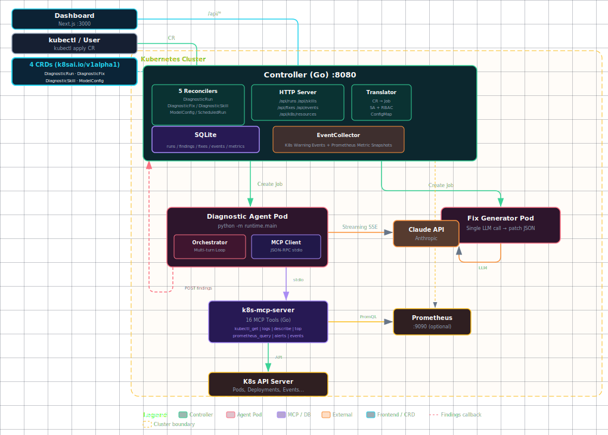

# kube-agent-helper

> Kubernetes-native AI diagnostic operator with auto-fix capabilities

**kube-agent-helper** is an AI agent that runs inside your Kubernetes cluster, diagnoses workload issues, and generates actionable fix suggestions. Declare a `DiagnosticRun` CR, and the controller spins up an isolated agent Pod that calls Claude via MCP tools, writes structured findings, and optionally produces `DiagnosticFix` CRs with patches or new resource manifests. Supports scheduled diagnostics, K8s event collection, and Prometheus metric snapshots.

[](https://github.com/googs1025/kube-agent-helper/actions/workflows/ci.yml)
[](LICENSE)

[中文](README.md)

## Features

- **CRD-driven diagnostics** — declare tasks with `DiagnosticRun`; extend with `DiagnosticSkill` CRs
- **4 CRDs** — `DiagnosticRun`, `DiagnosticSkill`, `ModelConfig`, `DiagnosticFix`
- **10 built-in skills** — health, security, cost, reliability, config-drift, alert-responder, network, node, rollout, storage
- **16 MCP tools** — kubectl, Prometheus, logs, network policies, PVC, node status, event history, metric snapshots, and more
- **Claude-powered agentic loop** — multi-turn reasoning over live cluster data
- **Scheduled diagnostics** — `spec.schedule` (cron) + `spec.historyLimit` for periodic automated runs; controller creates child runs on schedule
- **EventCollector** — background collector watches K8s Warning events and scrapes Prometheus metrics into SQLite, providing historical context to the agent
- **Fix generation** — click "Generate Fix" on any finding; a short-lived Pod produces a patch or full resource manifest via LLM
- **Before/After diff** — Fix detail page shows resource diff before applying
- **Human-in-the-loop approval** — Fixes go through `PendingApproval → Approved → Applying → Succeeded` with optional auto-rollback
- **Symptom-driven entry** — `/diagnose` page: arrive from a monitoring alert, select symptoms, pick a schedule preset (one-time / hourly / daily 08:00 / weekly Monday 08:00 / custom cron), get targeted diagnosis
- **Dashboard** — Next.js web UI with Chinese/English toggle, dark/light theme, stats, create dialogs, CRD YAML viewer, events page
- **Per-run output language** — `spec.outputLanguage: zh|en` controls finding language
- **Per-ModelConfig baseURL** — each `ModelConfig` CR can specify its own `spec.baseURL` proxy endpoint; Translator resolves baseURL and apiKeyRef from the ModelConfig CR per-run
- **Minimal RBAC** — Translator auto-generates least-privilege ServiceAccount per run
- **SQLite persistence** — findings, fixes, events, and metric snapshots stored locally; no external database required

## Architecture



## Quick Start

### Prerequisites

- Kubernetes cluster (minikube, kind, or any cloud cluster)
- `helm` >= 3.14
- An Anthropic API key (or compatible proxy)

### 1. Create the API key secret

```bash
kubectl create namespace kube-agent-helper
kubectl create secret generic anthropic-credentials \
  -n kube-agent-helper \
  --from-literal=apiKey=sk-ant-...
```

### 2. Create a ModelConfig CR

```yaml
apiVersion: k8sai.io/v1alpha1
kind: ModelConfig
metadata:
  name: anthropic-credentials
  namespace: kube-agent-helper
spec:
  provider: anthropic
  model: claude-3-5-sonnet-20241022
  baseURL: "https://my-proxy.example.com"   # optional, omit for direct Anthropic API
  apiKeyRef:
    name: anthropic-credentials
    key: apiKey
```

`spec.baseURL` lets each ModelConfig specify its own API proxy endpoint. The Translator resolves `baseURL` and `apiKeyRef` from the referenced ModelConfig CR when creating each agent Job, rather than from global controller config.

### 3. Install with Helm

```bash
helm install kah deploy/helm \
  --namespace kube-agent-helper
```

With a custom proxy and model:

```bash
helm install kah deploy/helm \
  --namespace kube-agent-helper \
  --set anthropic.baseURL=https://my-proxy.example.com \
  --set anthropic.model=claude-3-5-sonnet-20241022
```

### 4. Access the Dashboard

```bash
kubectl port-forward svc/kah -n kube-agent-helper 8080:8080 &
kubectl port-forward svc/kah-dashboard -n kube-agent-helper 3000:3000 &
open http://localhost:3000
```

### 5. Symptom-driven diagnosis (recommended)

Open Dashboard → click **Diagnose** → select namespace, resource, check symptoms (e.g. high CPU, pod crash-looping) → pick a schedule preset (one-time / hourly / daily / weekly / custom cron) → submit.

The system maps symptoms to skills, triggers a DiagnosticRun, and displays findings sorted by severity.

### 6. Create a run via kubectl

One-time diagnostic:

```yaml
apiVersion: k8sai.io/v1alpha1
kind: DiagnosticRun
metadata:
  name: cluster-health-check
  namespace: kube-agent-helper
spec:
  target:
    scope: namespace
    namespaces:
      - default
  modelConfigRef: "anthropic-credentials"
  timeoutSeconds: 600     # optional, nil = no timeout
  outputLanguage: en      # optional: zh | en
```

Scheduled diagnostic (every hour, keep last 5 runs):

```yaml
apiVersion: k8sai.io/v1alpha1
kind: DiagnosticRun
metadata:
  name: hourly-health-check
  namespace: kube-agent-helper
spec:
  target:
    scope: namespace
    namespaces:
      - default
  modelConfigRef: "anthropic-credentials"
  schedule: "0 * * * *"    # cron expression, runs every hour
  historyLimit: 5           # keep the 5 most recent child runs; older ones are garbage-collected
  outputLanguage: en
```

When the controller detects `spec.schedule`, it automatically creates child `DiagnosticRun` resources on the cron schedule and enforces `historyLimit` to clean up old runs.

```bash
kubectl apply -f the-above.yaml
kubectl get diagnosticrun cluster-health-check -w
```

### 7. Generate a Fix

From the dashboard: open a completed Run, click "Generate Fix" on any finding.

Or via API:

```bash
curl -X POST http://localhost:8080/api/findings/<finding-id>/generate-fix
```

Review the Before/After diff in the dashboard, then Approve or Reject.

### 8. View events

Open Dashboard → click **Events** → filter K8s Warning events by namespace, resource name, or time range.

The EventCollector runs in the background, continuously collecting cluster Warning events and Prometheus metric snapshots. During diagnosis, the agent can query this historical data via the `events_history` and `metric_history` MCP tools.

## Built-in Skills

| Skill | Dimension | Description |
|-------|-----------|-------------|
| `pod-health-analyst` | health | Detects CrashLoopBackOff, OOMKilled, pending pods, high restarts |
| `pod-security-analyst` | security | Checks privileged containers, missing securityContext |
| `pod-cost-analyst` | cost | Finds over-provisioned resource requests, zombie deployments |
| `reliability-analyst` | reliability | Analyzes probe config, PDB, replica counts |
| `config-drift-analyst` | reliability | Detects selector/label mismatches, broken ConfigMap/Secret refs |
| `alert-responder` | health | Triages firing Prometheus alerts to root cause |
| `network-troubleshooter` | reliability | Diagnoses Service connectivity and NetworkPolicy blocks |
| `node-health-analyst` | reliability | Detects node pressure (memory/disk/PID), capacity issues |
| `rollout-analyst` | health | Diagnoses stuck rollouts and failing new pod versions |
| `storage-analyst` | reliability | Diagnoses PVC Pending/Lost and volume mount failures |

Custom skills: create a `DiagnosticSkill` CR or place a `.md` file in `skills/`.

## CRDs

| CRD | Purpose |
|-----|---------|
| `DiagnosticRun` | Declares a diagnostic task (one-time or scheduled); controller creates agent Jobs |
| `DiagnosticSkill` | Declares a diagnostic skill (dimension, prompt, tools) |
| `ModelConfig` | LLM provider configuration (API key secret reference, `baseURL` proxy endpoint) |
| `DiagnosticFix` | A proposed fix (patch or new resource) with approval workflow |

### ModelConfig

The `ModelConfig` CR encapsulates the full LLM provider configuration. When creating an agent Pod, the Translator reads all parameters from the ModelConfig referenced by `DiagnosticRun.spec.modelConfigRef`:

| Field | Description |
|-------|-------------|
| `spec.provider` | LLM provider (e.g. `anthropic`) |
| `spec.model` | Model name |
| `spec.baseURL` | API proxy endpoint (optional; omit to use the provider's default URL) |
| `spec.apiKeyRef.name` | Secret name |
| `spec.apiKeyRef.key` | Key within the Secret |

### DiagnosticFix Lifecycle

```
DryRunComplete → [user approves] → Approved → Applying → Succeeded
                                                      → Failed → (auto-rollback) → RolledBack
                 [user rejects]  → Failed
```

Strategies: `dry-run` (review only), `auto` (apply patch), `create` (create new resource).

## API Endpoints

| Method | Path | Description |
|--------|------|-------------|
| GET | `/api/runs` | List diagnostic runs |
| POST | `/api/runs` | Create a DiagnosticRun CR |
| GET | `/api/runs/:id` | Get run details |
| GET | `/api/runs/:id/findings` | List findings |
| GET | `/api/runs/:id/crd` | Get the raw DiagnosticRun CR as YAML |
| GET | `/api/skills` | List registered skills |
| POST | `/api/skills` | Create a DiagnosticSkill CR |
| GET | `/api/fixes` | List fixes |
| GET | `/api/fixes/:id` | Get fix details |
| PATCH | `/api/fixes/:id/approve` | Approve a fix |
| PATCH | `/api/fixes/:id/reject` | Reject a fix |
| POST | `/api/findings/:id/generate-fix` | Trigger fix generation |
| GET | `/api/events` | List K8s Warning events (query params: namespace, name, since) |
| GET | `/api/k8s/resources` | List cluster resources for autocomplete |

## Development

```bash
make test        # unit tests
make envtest     # integration tests (requires kubebuilder)
make build       # build binaries
make image       # build Docker images
cd dashboard && npm run dev  # dashboard dev server
```

## Project Structure

```
cmd/controller/          Go controller entrypoint
internal/
  controller/
    api/v1alpha1/        CRD type definitions
    reconciler/          Run, Skill, Fix, ModelConfig, ScheduledRun Reconcilers
    translator/          Run → Job compiler, FixGenerator → Job compiler
    httpserver/          REST API handlers
    registry/            Skill registry (hot-reload)
  store/                 Store interface + SQLite implementation
  mcptools/              MCP tool implementations (16 tools)
  collector/             EventCollector (K8s Warning events + Prometheus metric scraping)
agent-runtime/
  runtime/
    main.py              Diagnostic agent entrypoint (multi-turn LLM)
    fix_main.py          Fix generator entrypoint (single LLM call)
    orchestrator.py      Agentic loop (httpx SSE streaming)
    mcp_client.py        MCP stdio client
    skill_loader.py      SKILL.md parser
dashboard/
  src/
    app/                 Next.js pages (runs, skills, fixes, diagnose, events)
    components/          UI components (dialogs, badges, diff viewer, CRD YAML viewer)
    i18n/                zh.json + en.json dictionaries
    theme/               Dark/light theme Context
    lib/                 API hooks (SWR), types, utilities
skills/                  Built-in skill .md files (10 skills)
deploy/helm/             Helm chart (CRDs, RBAC, Deployment)
```

## Roadmap

- [x] **Phase 1** — Operator MVP: 4 CRDs, single-run Job, 5 built-in skills
- [x] **Phase 2** — Dashboard, Skill Registry UI, i18n (zh/en), dark mode
- [x] **Phase 3** — DiagnosticFix: LLM patches, Before/After diff, HITL approval, auto-rollback
- [x] **Phase 3.5** — 5 new MCP tools, 10 built-in skills, symptom-driven /diagnose page
- [x] **Phase 4** — Scheduled diagnostics, EventCollector (events + metric scraping), 2 new MCP tools, ModelConfig baseURL, Dashboard events page and CRD YAML viewer
- [ ] **Phase 5** — Vector case memory (RAG), multi-cluster support, webhook notifications

## References

- [kagent](https://github.com/kagent-dev/kagent) — Kubernetes-native agent orchestration
- [ci-agent](https://github.com/googs1025/ci-agent) — GitHub CI pipeline AI analyzer

## License

Apache License 2.0 — see [LICENSE](LICENSE).
